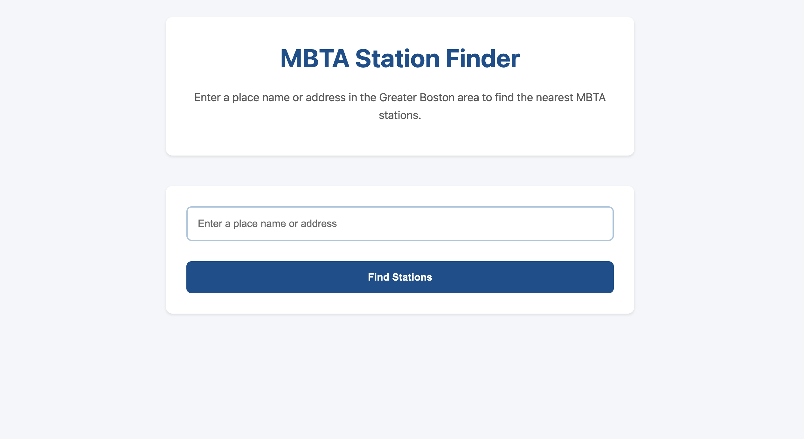
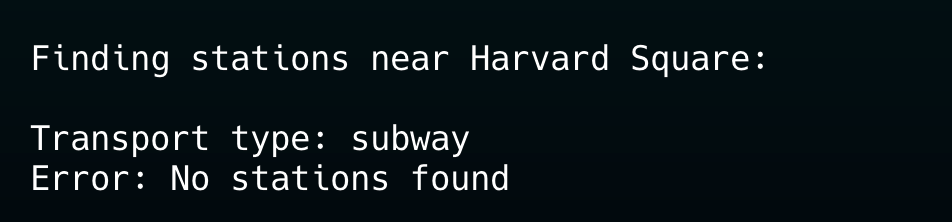
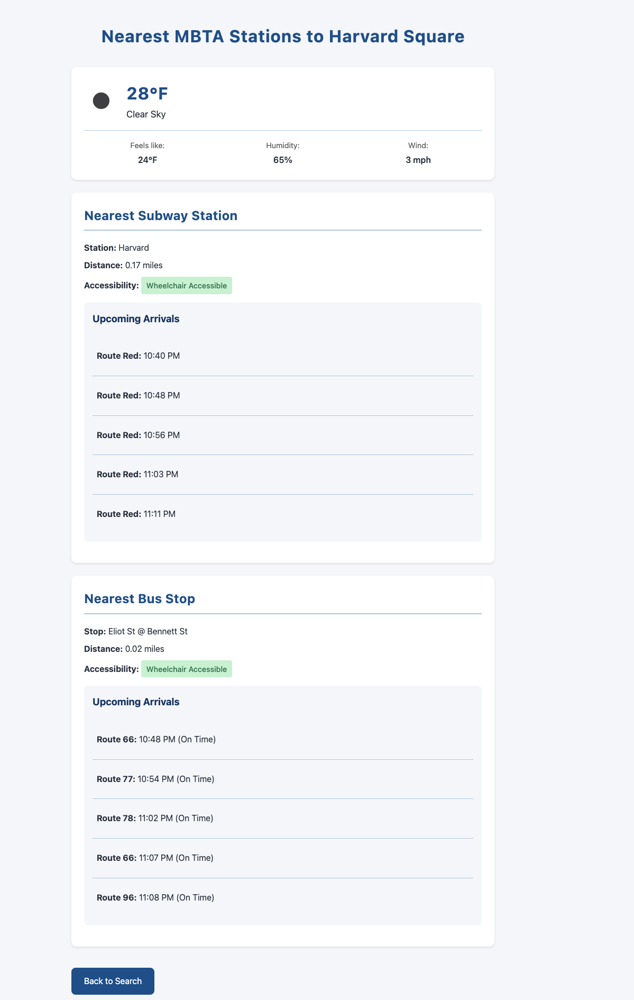
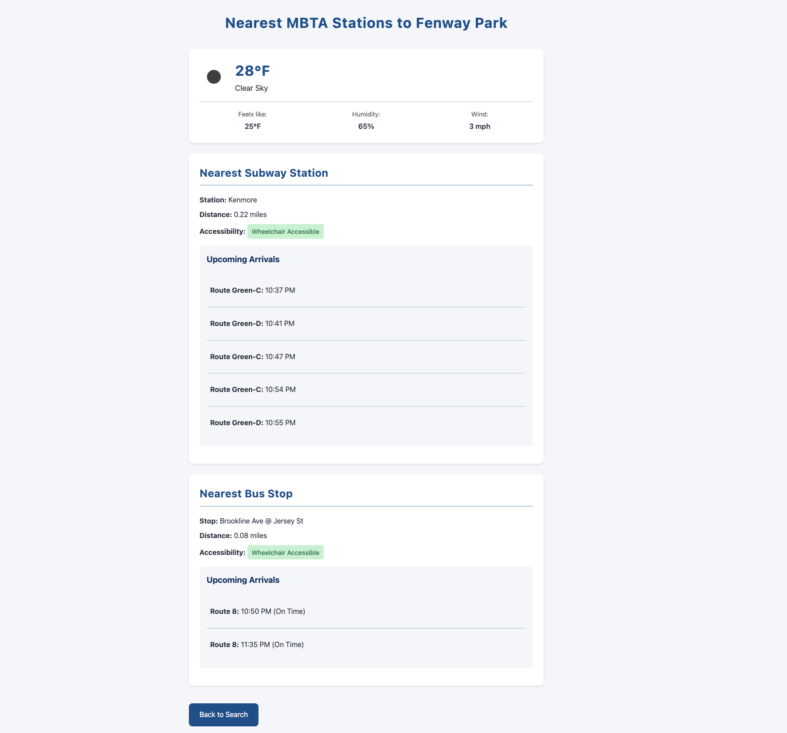

# MBTA Web App Project Reflection

**Team Member**: [Your Name]

## 1. Project Overview

For this project, I built a web app that helps people find their way around Boston using MBTA public transit. While the assignment just asked for finding the nearest T station, I wanted to make something more useful and fun to use. I expanded the functionality to include both subway and bus stops, so users have more transit options to choose from. To make the app look more modern and user-friendly, I added custom CSS styling, no more plain HTML! I also thought it would be helpful to know what the weather's like before heading out, so I integrated the OpenWeather API to show current conditions at the searched location. These extra features turned what could have been a simple station finder into a more practical example of a transit planning tool that I'd actually want to use myself if I developed it much further.

## 2. Reflection

### Development Process
Starting with the assignment's provided framework, I initially focused on getting the basic functionality working exactly as outlined in the instructions. This part went very smoothly since I was following the established structure. It wasn't until after I had the basic version working that I decided to expand the functionality to include both bus and subway options. This is where I ran into some challenges with the API calls that needed fixing, mainly because I was retrofitting the existing bus-only implementation to work with both transit types. 

Looking back, even though I was working from the provided framework, I should have planned for implementing both bus and subway functionality as soon as I decided to expand the project, rather than adding subway support as an afterthought. This would have prevented the need to restructure code and would have made the development process more straightforward. Despite these challenges, once I resolved the API integration issues, the rest of the development process went smoothly.

This experience taught me that even when working with a starter framework, it's important to plan ahead for any additional features you might want to add, rather than just building on top of the basic implementation.

### Team Work Division
As a solo developer on this project, I handled all aspects of development independently. This arrangement worked well for me, allowing me to make quick decisions and implement features at my own pace. The solo development approach gave me complete control over the project's direction and implementation choices. Looking back, I wouldn't change my approach to working independently on this project, as it allowed me to fully engage with all aspects of the development process and learn from each challenge firsthand.

### Learning Experience
This project opened my eyes to the incredible potential of free APIs, especially in the context of local transit systems. It's fascinating to discover that even something as everyday as riding the T has a freely accessible API that can be easily integrated into applications. This realization has changed my perspective on problem-solving in software development, there are often existing APIs and tools available that can provide the data we need, we just need to look for them.

The MBTA API, in particular, showed me how much public data is actually accessible and usable for creating practical applications. This lesson extends beyond just transit data, there's a whole world of free APIs out there that can enhance various projects, regardless of their focus. It's exciting to think about the possibilities and potential applications of these readily available data sources.

AI tools proved to be valuable allies during development, particularly when I needed to verify certain concepts or work on CSS styling. They served as a helpful reference point for double-checking my understanding and exploring different approaches to problems. The combination of working with APIs and utilizing AI tools has given me a broader perspective on modern software development resources and how to leverage them effectively.

In the end, here is what it looks like when you search for the nearest T station to Fenway Park!
